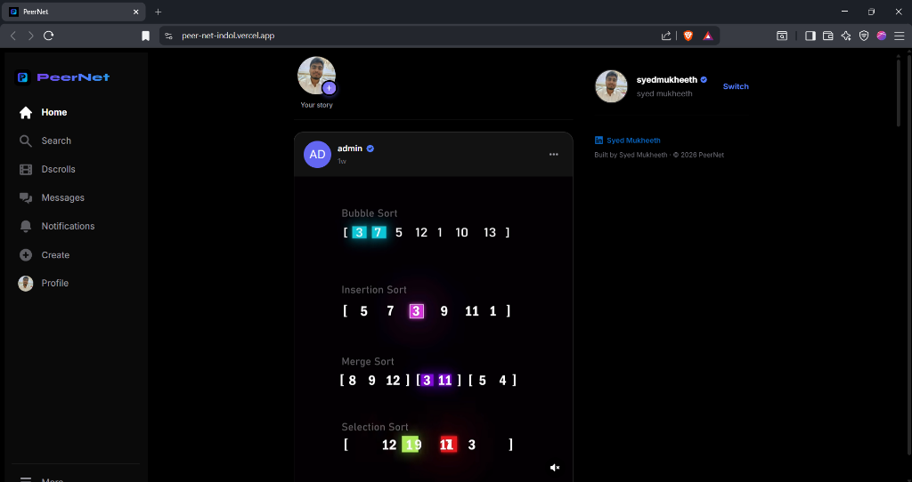
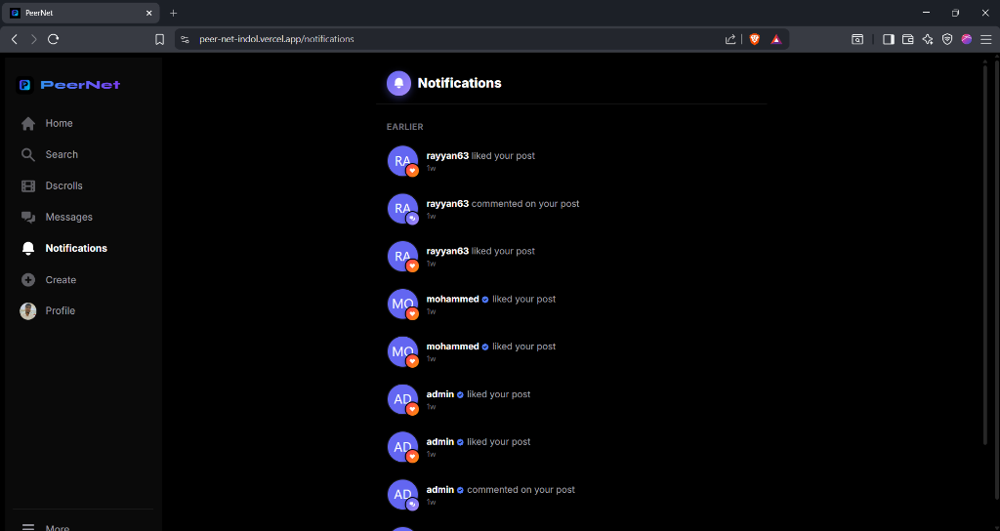
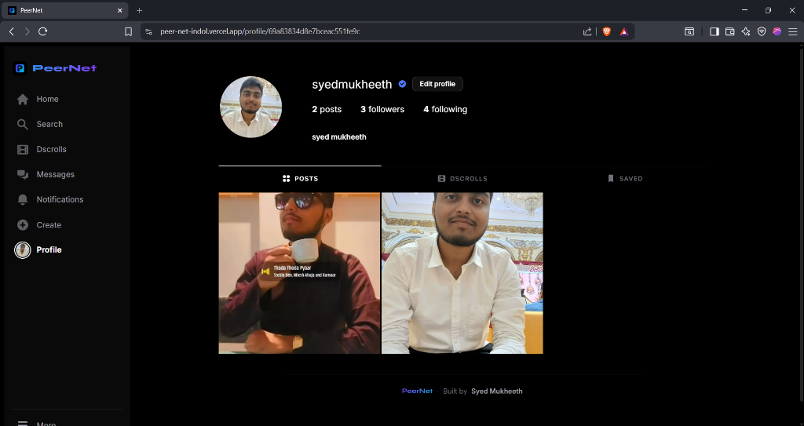
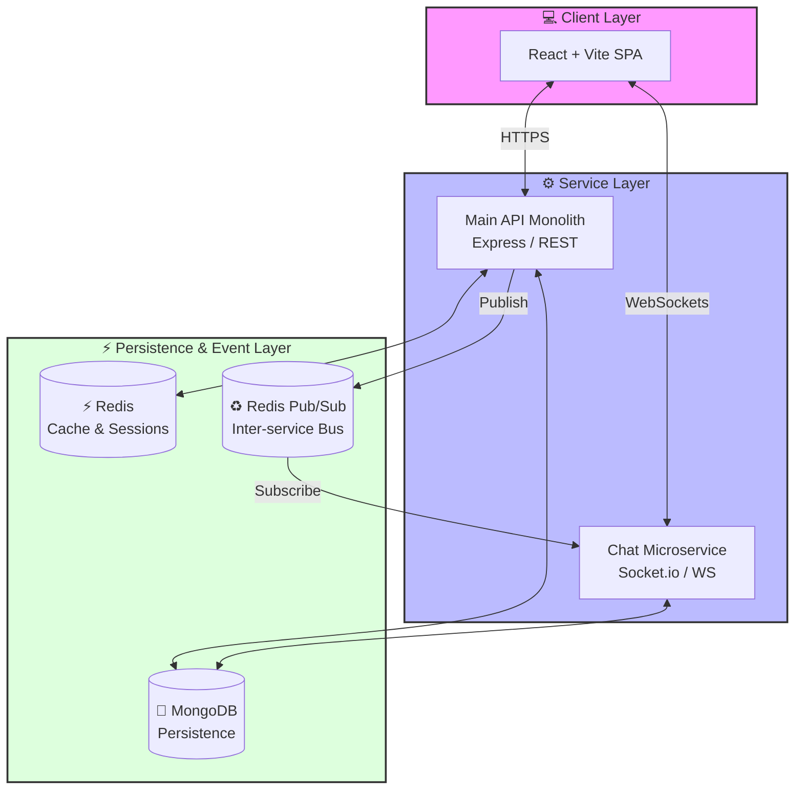

<div align="center">

  

  <h1>🚀 PeerNet</h1>
  <h3>The Ultimate Microservices-Powered Social Ecosystem</h3>

  <p align="center">
    <b>A high-performance, full-stack social media platform engineered for scale, real-time engagement, and aesthetic excellence.</b>
  </p>

  <div align="center">
    
    
    
    
  </div>

  <br />

  [🌐 Live Demo](https://peer-net-indol.vercel.app) • [📖 API Docs](https://peernet-5u5q.onrender.com/api-docs) • [💬 Chat Status](https://peernet-5u5q.onrender.com/health) • [🛠️ Architecture](#-system-architecture)

</div>

---

## 🌟 Overview

**PeerNet** is not just another social media clone; it's a sophisticated "Instagram-inspired" ecosystem built with modern engineering principles. It features a **decoupled microservices architecture**, real-time WebSocket communication, and a premium "Neon Network" design system.

### Core Pillars:
*   **⚡ Scalability**: Split into a REST API monolith and a dedicated WebSocket microservice (Chat Service).
*   **🚀 Performance**: Multi-layer caching with Redis and optimized frontend state with TanStack Query v5.
*   **🛡️ Security**: JWT-based auth with refresh token rotation and comprehensive middleware protection.
*   **💬 Real-Time**: Bi-directional event streaming for chat, typing indicators, and instant notifications.

---

## ✨ Premium Features

<div align="center">
  <table>
    <tr>
      <td width="50%">
        <h4>🎬 Dscrolls</h4>
        <p>Short-form vertical video experience with real-time interactions and seamless transition.</p>
      </td>
      <td width="50%">
        <h4>💬 Real-Time Chat</h4>
        <p>Microservice-powered messaging with typing states, online presence, and message history.</p>
      </td>
    </tr>
    <tr>
      <td width="50%">
        <h4>📸 Media Hub</h4>
        <p>High-fidelity image and video uploads powered by Cloudinary with optimized CDN delivery.</p>
      </td>
      <td width="50%">
        <h4>📖 Stories</h4>
        <p>24-hour ephemeral content with automated expiration via server-side Cron jobs.</p>
      </td>
    </tr>
     <tr>
      <td width="50%">
        <h4>🔔 Live Alerts</h4>
        <p>Instant push notifications for likes, follows, and mentions using Socket.io.</p>
      </td>
      <td width="50%">
        <h4>🛡️ Admin Suite</h4>
        <p>Comprehensive platform management, user moderation, and engagement statistics.</p>
      </td>
    </tr>
  </table>
</div>

---

## 🎨 Visual Showcase

<div align="center">
  <table border="0">
    <tr>
      <td></td>
      <td></td>
    </tr>
    <tr>
      <td></td>
      <td></td>
    </tr>
  </table>
</div>

---

## 🏗️ System Architecture

PeerNet leverages a hybrid architecture to balance robust data management with high-velocity real-time events.



---

## 💻 Tech Stack

### ⚡ Backend Excellence


### 🎨 Frontend Performance


---

## 🚀 Quick Start

### 1. Prerequisites
*   **Node.js** v20.x+
*   **MongoDB** (Local or Atlas)
*   **Redis** (Local or Cloud)
*   **Cloudinary** (Media handling)

### 2. Global Installation

```bash
# Clone & Enter
git clone https://github.com/syedmukheeth/PeerNet.git && cd PeerNet

# Install all dependencies
npm install

# Setup Environment
cp .env.example .env
```

### 3. Execution

**Containerized (Recommended)**
```bash
docker compose up -d --build
```

**Manual Development**
```bash
# Backend
cd backend && npm run dev

# Chat Microservice
cd chat-service && npm run dev

# Frontend
cd frontend && npm run dev
```

---

## 🛡️ Security & Scalability
*   **Hashed Passwords**: Argon2/Bcrypt with adaptive salt rounds.
*   **Refresh Token Rotation**: Enhanced security against session hijacking.
*   **Rate Limiting**: Intelligent sliding-window rate limiting on critical endpoints.
*   **Pub/Sub**: Redis-backed horizontal scaling for real-time events.

---

<div align="center">
  <p>Built with 💎 by <a href="https://github.com/syedmukheeth"><b>Syed Mukheeth</b></a></p>
  
  <a href="https://linkedin.com/in/syedmukheeth"></a>
  <a href="https://github.com/syedmukheeth"></a>
</div>
