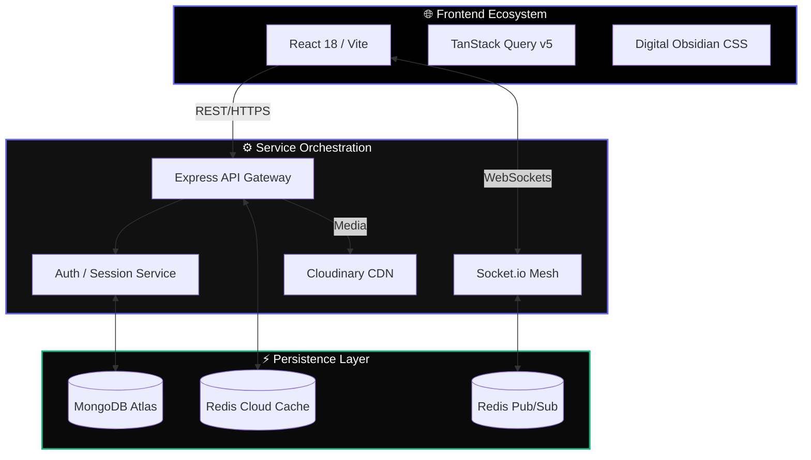

<div align="center">

  

  # 💎 PeerNet v2.2 Professional
  ### Production-Grade Decentralized Social Infrastructure

  <p align="center">
    <b>Engineered for data sovereignty, real-time immersion, and architectural excellence.</b>
  </p>

  <div>
    
    
    
  </div>

  <br />

  [🌐 Live Portal](https://peer-net-indol.vercel.app) • [📚 API Blueprint](https://peernet-5u5q.onrender.com/api-docs) • [📊 System Health](https://peernet-5u5q.onrender.com/health) • [🛠️ Architecture](#-technical-architecture)

</div>

---

## 🎭 The Vision

PeerNet is a high-performance social ecosystem built with a **Microservices-First** philosophy. It bridges the gap between traditional social media engagement and modern engineering requirements: high availability, real-time bi-directional data flow, and "Digital Obsidian" aesthetics.

### 🚀 Key Engineering Pillars
- **Atomic Scaling**: Separated REST monolith and WebSocket signaling layer.
- **Tonal Layering**: A premium UI design system based on depth, prismatic accents, and editorial typography.
- **Trust Maturity**: Integrated rate limiting, email verification (planned), and legal compliance frameworks.
- **Real-Time Mesh**: Instant notifications and messaging powered by a Redis-backed Pub/Sub bus.

---

## ✨ High-Fidelity Features

| Feature | Engineering Detail | Status |
| :--- | :--- | :--- |
| **🎬 Dscrolls** | Optimized vertical video streaming with Framer Motion transitions. | ✅ PROD |
| **💬 Quantum Chat** | Microservice-driven messaging with typing states & presence logic. | ✅ PROD |
| **🔔 Neural Alerts** | Real-time notification engine with smart batching and deduplication. | ✅ PROD |
| **🛡️ Guard Mode** | Sliding-window rate limiting & JWT rotation for session integrity. | ✅ PROD |
| **📖 Ephemera** | Story system with automated server-side lifecycle management (Cron). | ✅ PROD |
| **💡 UX Polish** | Glassmorphism, premium haptics, and zero-flicker state hydration. | ✅ PROD |

---

## 🏗️ Technical Architecture

PeerNet utilizes a distributed architecture to maintain sub-100ms response times for critical interactions.



---

## 💻 Elite Tech Stack

### Infrastructure & Security
- **Node.js 20+**: Core execution environment.
- **Express / Joi**: Schema-driven API management.
- **Redis**: Multi-layer caching and horizontal WebSocket orchestration.
- **Express-Rate-Limit**: Brute-force and DDoS mitigation.
- **Helmet / CORS**: Hardened HTTP headers and origin control.

### Presentation Layer
- **React 18**: Component-level reactivity.
- **Framer Motion**: Editorial-grade animations.
- **Syne & Inter**: Sophisticated typography pairing.
- **React-Helmet-Async**: On-the-fly SEO optimization.

---

## 🚀 Deployment & Ignition

### 1. Environmental Configuration
Clone the repository and initialize the configuration:
```bash
git clone https://github.com/syedmukheeth/PeerNet.git
cd PeerNet
npm install
cp .env.example .env
```

### 2. Infrastructure Spin-up
**Dockerized Environment (Best for Production Parity)**
```bash
docker compose up -d --build
```

**Development Mode (Granular Control)**
```bash
# Terminal 1: Backend Monolith
cd backend && npm run dev

# Terminal 2: Real-time Microservice
cd chat-service && npm run dev

# Terminal 3: UI Dashboard
cd frontend && npm run dev
```

---

## 🛡️ Compliance & Safety
- **GDPR Ready**: Integrated Cookie Consent and transparent data usage protocols.
- **Legal Transparency**: On-platform Privacy Policy and Terms of Service.
- **Bug Reporting**: In-app feedback system for direct developer communication.

---

<div align="center">
  <p>Crafted with precision by <b><a href="https://github.com/syedmukheeth">Syed Mukheeth</a></b></p>
  
  <a href="https://linkedin.com/in/syedmukheeth"></a>
  <a href="https://github.com/syedmukheeth"></a>
</div>
