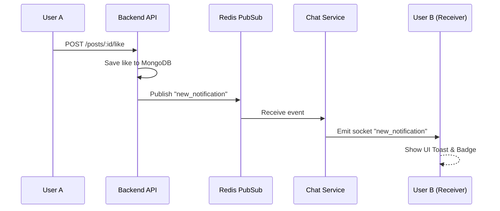

<div align="center">
  
  <h1>PeerNet — Social Media Platform</h1>
  <p><strong>Connect · Share · Discover</strong></p>
  <p>A production-grade, full-stack social media platform built for scale, inspired by Instagram.</p>

  
  
  
  

  <br />
  🌐 **Live:** [peer-net-indol.vercel.app](https://peer-net-indol.vercel.app) | 🔧 **API:** [peernet-5u5q.onrender.com](https://peernet-5u5q.onrender.com/health)
</div>

---

## 🌟 What is PeerNet?

PeerNet is a complete social media ecosystem designed to be **beginner-friendly to deploy**, yet **powerful enough for production**. It features:

- 📸 **Posts & Feeds:** Image/video carousels, likes, comments, and saves.
- 🎬 **Dscrolls (Reels):** A dedicated, infinite-scroll view for short-form video content with a pixel-perfect, mobile-first UI.
- 💬 **Real-Time Messaging:** Instant chat with indicators for typing and read receipts.
- 🔔 **Instant Notifications:** Robust multi-channel delivery ensuring you never miss an interaction.
- 📱 **Responsive Design:** Beautiful, app-like experience on mobile and standard desktop layouts.

---

## 🏗️ System Architecture & Flow

PeerNet uses a microservices-inspired architecture to separate high-throughput real-time events from standard REST API calls.

### 1. High-Level Architecture
```mermaid
graph TD
    Client[📱 Frontend Client\nReact + Vite] -->|HTTPS REST| API[⚙️ Main Backend API\nNode.js + Express]
    Client <-->|WebSockets| Chat[💬 Chat Microservice\nSocket.io]
    
    API <--> DB[(🍃 MongoDB\nUser Data & Posts)]
    API <--> Cache[(⚡ Redis\nCache & Auth)]
    
    Chat <--> DB
    Chat <--> PubSub[(♻️ Redis Pub/Sub\nEvent Bus)]
    API -->|Publish Events\n(Likes, Follows)| PubSub
```

### 2. Real-Time Notification Flow
How a user receives a notification instantly when someone likes their post:


---

## 🚀 Getting Started (Beginner Friendly)

If you are new to web development, don't worry! Follow these steps to get PeerNet running on your own computer.

### Prerequisites
Before you start, make sure you have installed:
1. **[Node.js](https://nodejs.org/)** (Version 18 or higher)
2. **MongoDB Database:** You can run it locally, or use [MongoDB Atlas](https://www.mongodb.com/cloud/atlas) for a free cloud database.
3. **Redis:** Run it locally, or use [Redis Cloud](https://redis.com/) for a free cloud instance.
4. **Cloudinary:** Create a free account at [Cloudinary](https://cloudinary.com/) to store uploaded images and videos.

### Step 1: Clone the Project
Open your terminal (or command prompt) and run:
```bash
git clone https://github.com/syedmukheeth/PeerNet.git
cd PeerNet
```

### Step 2: Configure Environment Variables
PeerNet uses environment variables to store secrets like database passwords. 
1. In the root `PeerNet` folder, duplicate the `.env.example` file and rename it to `.env`.
2. Open `.env` in your code editor and fill in your details:
   - `MONGO_URI`: Your MongoDB connection string.
   - `REDIS_URL`: Your Redis connection string.
   - `CLOUDINARY_*`: Your Cloudinary API keys.
   - `JWT_*`: Random strings used for security (just type some random characters for local testing).

### Step 3: Install Dependencies
You need to install packages for both the frontend and two backend services. Open 3 terminal windows/tabs:

**Terminal 1 (Main Backend):**
```bash
cd backend
npm install
npm run dev
```

**Terminal 2 (Chat Service):**
```bash
cd chat-service
npm install
npm run dev
```

**Terminal 3 (Frontend):**
```bash
cd frontend
npm install
npm run dev
```

That's it! Visit `http://localhost:5173` in your browser.

*(Optional)* To create some fake test data, run:
```bash
cd backend
npm run seed
```

---

## 🌍 Deploying to Production

When you are ready to share your app with the world, follow these production deployment steps.

### 1. Deploying the Backend & Chat Service (Render.com)
We recommend Render for hosting Node.js applications.
1. Create a Web Service on Render linked to your GitHub repo.
2. **Root Directory:** `backend` (Create a separate service for `chat-service` with root directory `chat-service`).
3. **Build Command:** `npm install`
4. **Start Command:** `npm start`
5. **Environment Variables:** Copy all variables from your `.env` file into Render's Environment panel.
   - *Important:* Set `NODE_ENV=production`.
   - Update `CLIENT_URL` to your future frontend URL (e.g., `https://my-frontend.vercel.app`).
   - Update `ALLOWED_ORIGINS` to include your frontend URL.

### 2. Deploying the Frontend (Vercel.com)
Vercel is perfect for React/Vite apps.
1. Import your GitHub repository into Vercel.
2. **Root Directory:** `frontend`
3. Vercel will automatically detect Vite. 
4. **Environment Variables:** Add the following variables to connect to your live Render backends:
   - `VITE_API_URL=https://<your-render-backend-url>/api/v1`
   - `VITE_CHAT_API_URL=https://<your-render-chat-url>`
5. Click **Deploy**.

---

## 🛠️ Tech Stack Detailed Summary

### Frontend Architecture
| Area | Technology |
|---|---|
| Core | **React 18** + **Vite** |
| Routing | React Router v7 |
| HTTP & State | Axios + **TanStack React Query** |
| Real-time | Socket.io-client |
| Styling & UI | Custom CSS, **Framer Motion** (animations), React Hot Toast |

### Backend Architecture
| Area | Technology |
|---|---|
| Runtime | Node.js 20 |
| Framework | Express 4 |
| Database | **MongoDB** (Mongoose) |
| Cache & PubSub | **Redis** |
| Auth | JWT (Access + HttpOnly Refresh Tokens) |
| Media Storage | Cloudinary |
| Real-time | **Socket.io 4** |
| Security | Helmet, express-rate-limit, express-mongo-sanitize |

---

## 🛡️ Security Best Practices Used
PeerNet implements robust security measures for production:
- **Token Rotation:** Refresh tokens are rotated. Old tokens are blacklisted in Redis immediately.
- **XSS Protection:** Data is sanitized before database storage. React handles frontend escaping natively.
- **NoSQL Injection:** Inputs are sanitized to prevent operator injection (`$` or `.`).
- **Rate Limiting:** Strict limits on authentication endpoints (e.g., 5 login attempts per 15 mins) and global APIs.

---

## 🤝 Contributing
Contributions, issues, and feature requests are welcome!
Feel free to check out the [issues page](https://github.com/syedmukheeth/PeerNet/issues) if you want to contribute.

---

## 📝 License
This project is [MIT](./LICENSE) licensed.

<div align="center">
  <br/>
  <b>Built by Syed Mukheeth</b>
</div>
