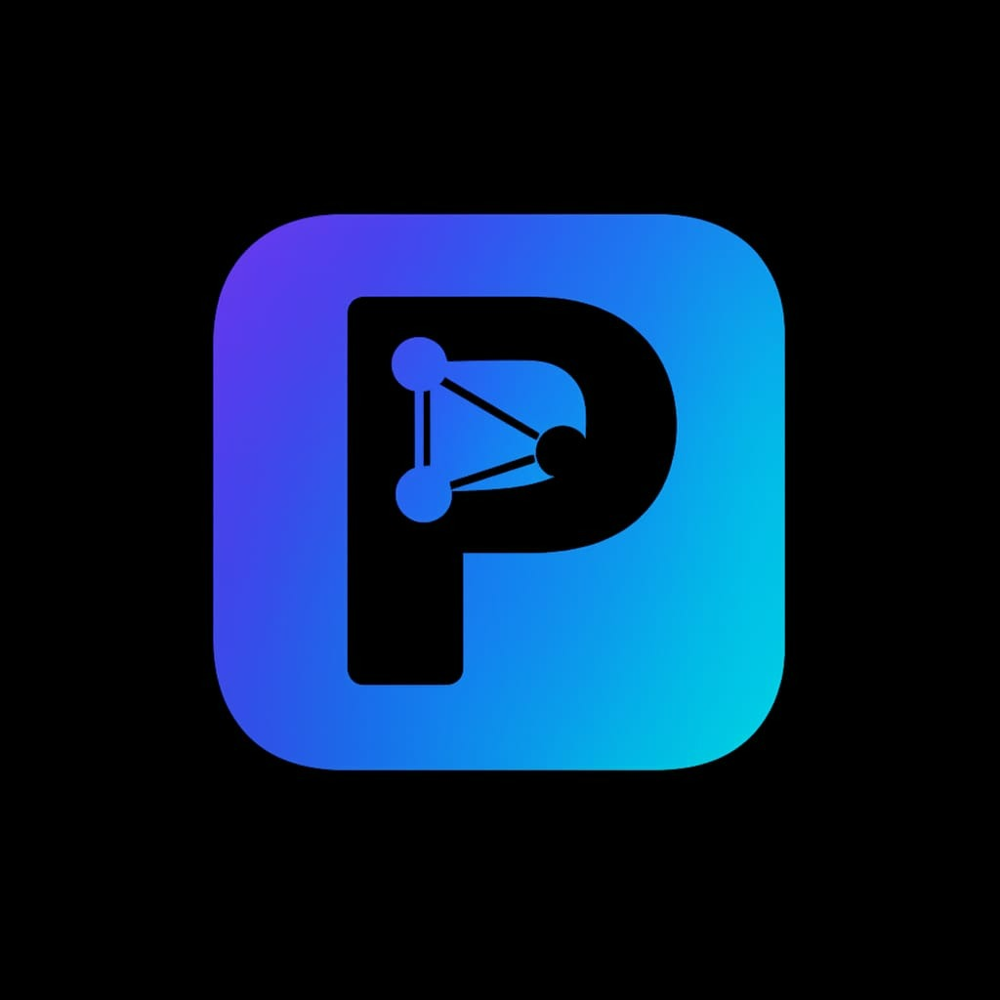
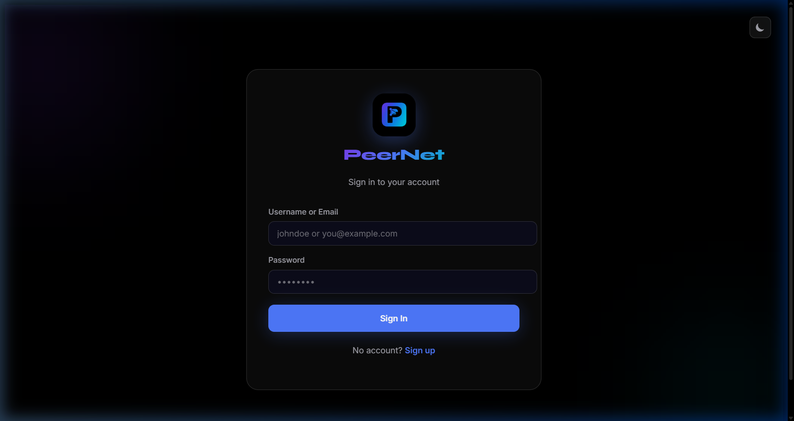
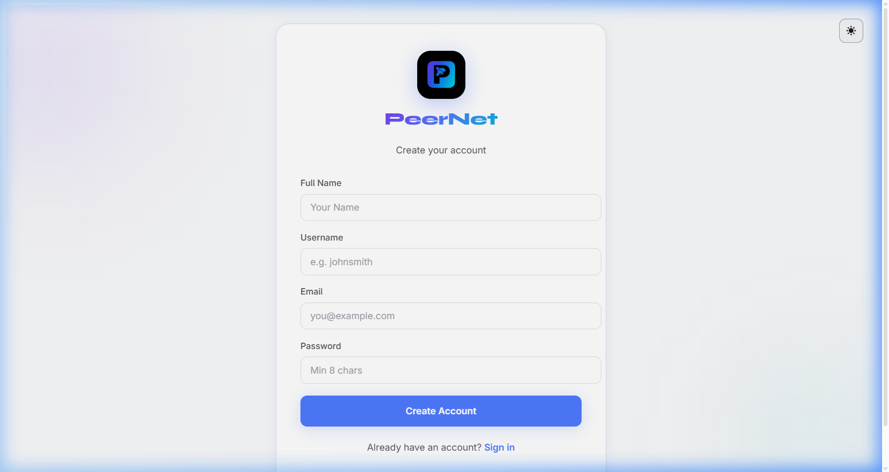
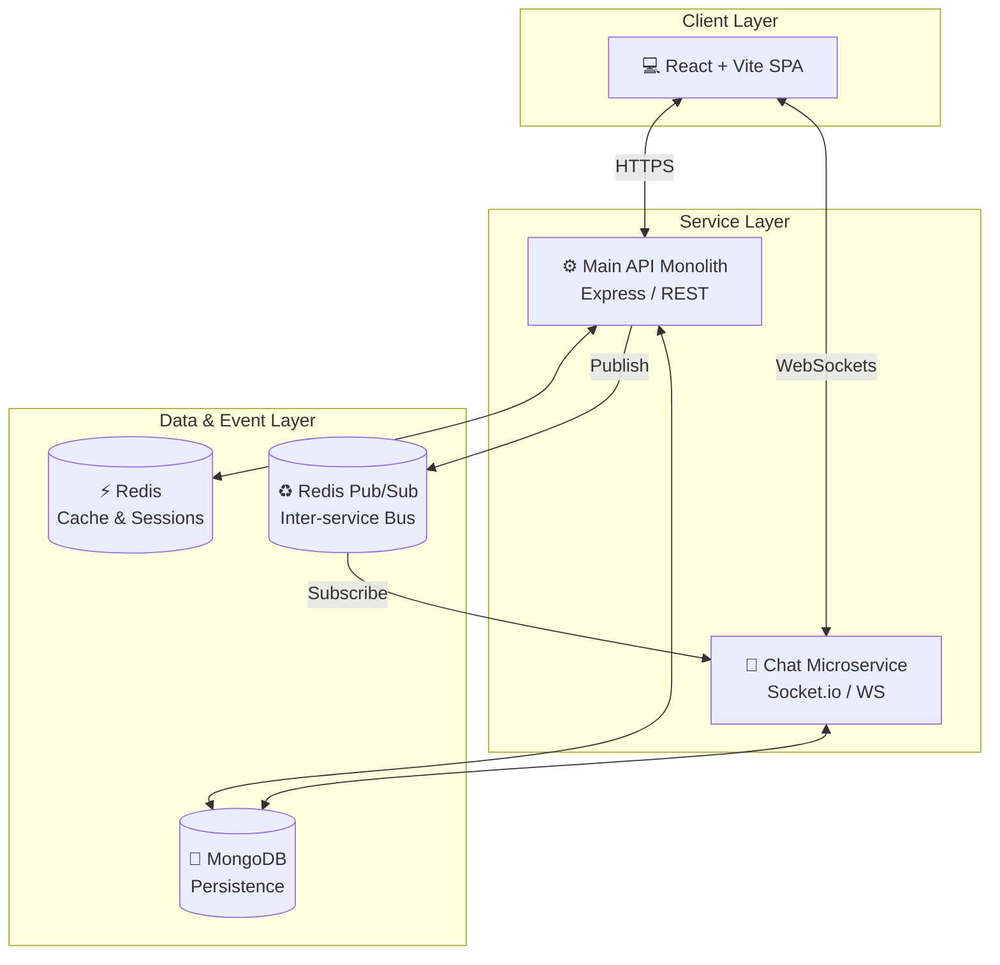

<div align="center">
  <br />
  
  
  <br />

  <h1>🚀 PeerNet — The Ultimate Social Ecosystem</h1>
  
  <p align="center">
    <strong>Microservices · Real-Time · Production-Ready</strong>
    <br />
    A high-performance, full-stack social media platform engineered for scale and aesthetic excellence.
  </p>

  <div align="center">
    
    
    
    
  </div>

  <br />

  [🌐 Live Demo](https://peer-net-indol.vercel.app) • [📖 API Docs](https://peernet-5u5q.onrender.com/api-docs) • [💬 Chat Status](https://peernet-5u5q.onrender.com/health)
</div>

---

## 🌟 Overview

PeerNet is not just another social media clone; it's a sophisticated "Instagram-inspired" ecosystem built with modern engineering principles. It features a **decoupled microservices architecture**, real-time WebSocket communication, and a premium "Neon Network" design system.

### Core Pillars:
- **Scalability**: Split into a REST API monolith and a dedicated WebSocket microservice.
- **Performance**: Multi-layer caching with Redis and optimized frontend state with TanStack Query.
- **Security**: JWT-based auth with refresh token rotation and comprehensive middleware protection.
- **Real-Time**: Bi-directional event streaming for chat, typing indicators, and instant notifications.

---

## ✨ Key Features

| Feature | Description |
| :--- | :--- |
| **🎬 Dscrolls** | Short-form vertical video experience with real-time interactions. |
| **💬 Real-Time Chat** | Microservice-powered messaging with typing states and online presence. |
| **📸 Media Hub** | High-fidelity image and video uploads powered by Cloudinary. |
| **📖 Stories** | 24-hour ephemeral content with automated expiration via Cron jobs. |
| **🔔 Live Alerts** | Instant push notifications for likes, follows, and mentions. |
| **🌗 Dual Theme** | Seamless transition between "Deep Space" Dark and "Clean White" Light modes. |
| **🛡️ Admin Suite** | Comprehensive platform management and engagement statistics. |

---

## 📸 Screenshots

<div align="center">
  <table>
    <tr>
      <td width="50%">
        <p align="center"><b>Login — Dark Mode</b></p>
        
      </td>
      <td width="50%">
        <p align="center"><b>Register — Light Mode</b></p>
        
      </td>
    </tr>
  </table>
</div>

---

## 🏗️ System Architecture

PeerNet leverages a hybrid architecture to balance robust data management with high-velocity real-time events.



---

## 💻 Tech Stack

### Backend Infrastructure
- **Runtime**: Node.js 20 (LTS)
- **Framework**: Express.js
- **Primary Database**: MongoDB (Mongoose ODM)
- **Cache & Message Broker**: Redis
- **Security**: JWT (Access + Refresh Rotation), Helmet, Rate Limiting
- **Documentation**: Swagger / OpenAPI 3.0

### Frontend Excellence
- **Library**: React 18
- **Build Tool**: Vite
- **State Management**: TanStack React Query (v5)
- **Animations**: Framer Motion
- **Icons**: React Icons (Hi, Ri, Fi)
- **Styling**: Vanilla CSS with custom "Premium Neon" Design System

---

## 🚀 Getting Started

### 1. Prerequisites
- **Node.js** v20.x or higher
- **MongoDB** (Atlas or Local)
- **Redis** (Cloud or Local)
- **Cloudinary** Account (for media uploads)

### 2. Installation

```bash
# Clone the repository
git clone https://github.com/syedmukheeth/PeerNet.git
cd PeerNet

# Install root dependencies
npm install

# Setup environment
cp .env.example .env
```

### 3. Environment Configuration
Edit the `.env` file at the root:

```env
PORT=3000
MONGO_URI=your_mongodb_uri
REDIS_URL=your_redis_url
JWT_ACCESS_SECRET=your_secret
JWT_REFRESH_SECRET=your_secret
CLOUDINARY_CLOUD_NAME=your_name
CLOUDINARY_API_KEY=your_key
CLOUDINARY_API_SECRET=your_secret
```

### 4. Running the Development Stack

You can run everything using Docker:
```bash
docker compose up -d --build
```

Or manually:
```bash
# Terminal 1: Backend API
cd backend && npm run dev

# Terminal 2: Chat Microservice
cd chat-service && npm run dev

# Terminal 3: Frontend Client
cd frontend && npm run dev
```

---

## 🛡️ Security Implementation
- **Password Hashing**: `bcryptjs` with 12 salt rounds.
- **CSRF/XSS Protection**: Helmet.js and custom sanitization middleware.
- **Session Security**: `httpOnly` cookies for refresh tokens.
- **Input Validation**: Strict Joi schemas for every API endpoint.

---

## 📜 License

Distributed under the MIT License. See `LICENSE` for more information.

---

<div align="center">
  <p>Built with ❤️ by <a href="https://github.com/syedmukheeth">Syed Mukheeth</a></p>
  <p><b>Connect with me:</b> <a href="https://linkedin.com/in/syedmukheeth">LinkedIn</a></p>
</div>
