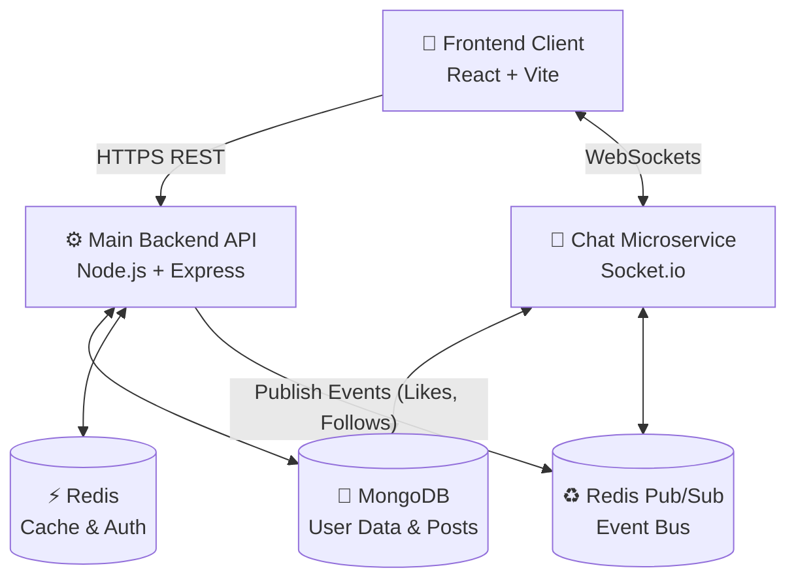
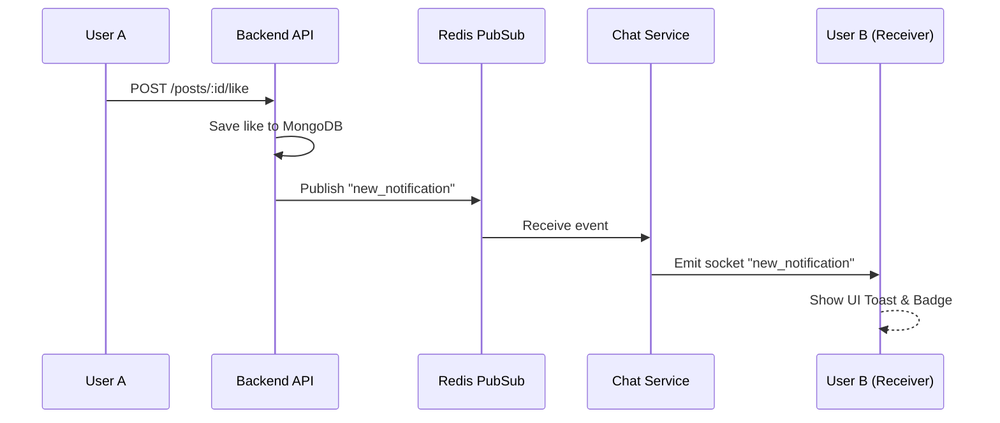

<div align="center">
  
  <h1>PeerNet — Social Media Platform</h1>
  <p><strong>Connect · Share · Discover</strong></p>
  <p><b>Built by Syed Mukheeth</b></p>
  <p>A production-grade, full-stack social media platform built for scale, inspired by Instagram.</p>

  
  
  
  

  <br />
  🌐 Live: (https://peer-net-indol.vercel.app) | 🔧 API: (https://peernet-5u5q.onrender.com/health)
</div>

---

## What is PeerNet?

PeerNet is a full-stack social media platform featuring posts, stories, **Dscrolls** (short-form videos), real-time messaging, live notifications, and an admin panel — all production-ready with JWT authentication, Redis caching, Cloudinary media storage, Socket.io real-time communication, and Docker deployment support.

---

## 🏗️ System Architecture & Flow

PeerNet uses a microservices-inspired architecture to separate high-throughput real-time events from standard REST API calls.

### 1. High-Level Architecture


### 2. Real-Time Notification Flow
How a user receives a notification instantly when someone likes their post:


---

## Tech Stack

### Backend
| Area | Technology |
|---|---|
| Runtime | Node.js 20 |
| Framework | Express 4 |
| Database | MongoDB 7 (Mongoose) |
| Cache / Sessions | Redis 7 |
| Auth | JWT — 15min access + 7d refresh rotation |
| Media Storage | Cloudinary |
| Real-time | Socket.io 4 + Redis Adapter |
| Validation | Joi |
| API Docs | Swagger UI (OpenAPI 3.0) |
| Testing | Jest + MongoDB Memory Server |
| Logging | Winston + daily log rotation |
| Security | Helmet, rate-limit, mongo-sanitize |
| Scheduler | node-cron |

### Frontend
| Area | Technology |
|---|---|
| Framework | React 18 + Vite |
| Routing | React Router v7 |
| HTTP Client | Axios |
| State Management | TanStack React Query |
| Real-time | Socket.io-client |
| Testing | Vitest + React Testing Library |
| Animations | Framer Motion |
| Icons | React Icons |
| Notifications | React Hot Toast |

### Infrastructure
| Area | Technology |
|---|---|
| Container | Docker + Docker Compose |
| Reverse Proxy | Nginx |
| CI/CD | GitHub Actions |
| Backend Host | Render |
| Frontend Host | Vercel |

---

## Full Project Structure

```
PeerNet/
├── frontend/                   # React + Vite client UI
│   ├── src/
│   │   ├── api/                # Axios instance & interceptors
│   │   ├── assets/             # Images, static logos, and icons
│   │   ├── components/         # Reusable UI (PostCard, Navbar, Modals)
│   │   ├── context/            # React context API (AuthContext, ThemeContext)
│   │   ├── pages/              # Main route views (Feed, Dscrolls, Messages, Login)
│   │   └── utils/              # Helper functions (timeago, image processing)
│   ├── index.html              # HTML DOM entry
│   └── vite.config.js          # Vite build & plugin configuration
│
├── backend/                    # Core REST API monolith (Node.js/Express)
│   ├── src/
│   │   ├── config/             # DB connection, Redis, Logger configs
│   │   ├── controllers/        # Route-handling logic (posts, users, auth)
│   │   ├── middleware/         # Auth verification, parameter validation, rate-limiter
│   │   ├── models/             # Mongoose DB schema definitions (User, Post)
│   │   ├── routes/v1/          # Express route declarations and versions
│   │   ├── services/           # Underlying business algorithms and DB interactions
│   │   ├── sockets/            # Socket.io push-notification logic
│   │   ├── validators/         # Joi validation rules protecting API boundaries
│   │   ├── jobs/               # Background Cron jobs (story auto-expiration)
│   │   └── seeders/            # Fake mock/dummy user generator scripts
│   ├── app.js                  # Main Express pipeline creation
│   └── server.js               # Entry point, connects DB and listens on port
│
├── chat-service/               # Dedicated Real-time WebSocket microservice
│   ├── src/
│   │   ├── controllers/        # HTTP handlers handling message queries
│   │   ├── models/             # Conversation and Messages schema specifically
│   │   ├── routes/v1/          # HTTP chat history loading endpoints
│   │   └── sockets/            # Chat room logic, user typing states, presence detection
│   └── server.js               # Microservice boot (Port 3001 typically)
│
├── nginx/default.conf          # Nginx reverse proxy configuration for caching rules
├── Dockerfile                  # Production-level application container image definition
├── docker-compose.yml          # Container configuration pulling in Mongo & Redis locally
├── .env.example                # Base environment variables required
├── CHANGELOG.md                # Update history of the project
└── README.md                   # You are here
```

---

## Getting Started (Local Development)

### Prerequisites

- [Node.js 20+](https://nodejs.org/)
- MongoDB (local or [MongoDB Atlas](https://www.mongodb.com/cloud/atlas))
- Redis (local or [Redis Cloud](https://redis.com/))
- [Cloudinary](https://cloudinary.com/) account (free tier works)

---

### 1. Clone the repository

```bash
git clone https://github.com/syedmukheeth/PeerNet.git
cd PeerNet
```

---

### 2. Set up environment variables

The `.env` file lives at the **project root** (`PeerNet/.env`):

```bash
cp .env.example .env
```

Fill in your values:

```env
# ── Application ─────────────────────────────
NODE_ENV=development
PORT=3000
CLIENT_URL=http://localhost:5173

# ── Database ─────────────────────────────────
MONGO_URI=mongodb+srv://<user>:<password>@cluster.mongodb.net/PeerNet?retryWrites=true&w=majority

# ── Redis ─────────────────────────────────────
REDIS_URL=redis://default:<password>@<host>:<port>

# ── JWT ───────────────────────────────────────
JWT_ACCESS_SECRET=<at_least_64_random_chars>
JWT_REFRESH_SECRET=<at_least_64_different_random_chars>
JWT_ACCESS_EXPIRES_IN=15m
JWT_REFRESH_EXPIRES_IN=7d

# ── Cloudinary ────────────────────────────────
CLOUDINARY_CLOUD_NAME=your_cloud_name
CLOUDINARY_API_KEY=your_api_key
CLOUDINARY_API_SECRET=your_api_secret

# ── CORS ──────────────────────────────────────
ALLOWED_ORIGINS=http://localhost:3000,http://localhost:5173

# ── Rate Limiting ─────────────────────────────
RATE_LIMIT_WINDOW_MS=900000
RATE_LIMIT_MAX=100
AUTH_RATE_LIMIT_MAX=5

# ── Logging ───────────────────────────────────
LOG_LEVEL=info
LOG_DIR=logs

# ── Cookie ────────────────────────────────────
COOKIE_SECURE=false
```

> **MongoDB Atlas users:** Make sure your IP is whitelisted under **Network Access** in the Atlas dashboard. For cloud deployments (Render), use `0.0.0.0/0` to allow all IPs.

---

### 3. Install dependencies

**Backend:**
```bash
cd backend
npm install
```

**Frontend:**
```bash
cd frontend
npm install
```

---

### 4. Seed the database *(optional)*

```bash
cd backend
npm run seed          # Creates basic test users  (password: Seed@1234)
npm run seed:celebs   # Creates celebrity accounts (password: Celeb@1234)
```

---

### 5. Run the isolated Microservices

**Terminal 1: Backend Monolith** (from `backend/` folder):
```bash
npm run dev    # Development with hot-reload
```
> Runs at: `http://localhost:3000`

**Terminal 2: Chat Service** (from `chat-service/` folder):
```bash
npm run dev    # Real-time WebSocket Service
```
> Runs at: `http://localhost:3001`

**Terminal 3: Frontend** (from `frontend/` folder):
```bash
npm run dev
```
> Runs at: `http://localhost:5173`

---

## Docker Deployment

Run the full stack (backend + MongoDB + Redis + Nginx) with one command:

```bash
cd PeerNet
cp .env.example .env
# Fill in your Cloudinary credentials in .env
# MONGO_URI and REDIS_URL are automatically set by docker-compose

docker compose up -d --build
```

| Service | Port |
|---|---|
| App (API) | 3000 |
| Nginx | 80 |
| MongoDB | 27017 |
| Redis | 6379 |

**Seed inside Docker:**
```bash
docker compose exec app node src/seeders/seed.js
```

---

## 🌍 Deploying to Production (Render & Vercel)

### 1. Deploying the Backend & Chat Service (Render.com)
We recommend Render for hosting Node.js applications.
1. Create a Web Service on Render linked to your GitHub repo.
2. **Root Directory:** `backend` (Create a separate service for `chat-service` with root directory `chat-service`).
3. **Build Command:** `npm install`
4. **Start Command:** `npm start`
5. **Environment Variables:** Copy all variables from your `.env` file into Render's Environment panel.
   - *Important:* Set `NODE_ENV=production`.
   - Update `CLIENT_URL` to your future frontend URL (e.g., `https://my-frontend.vercel.app`).
   - Update `ALLOWED_ORIGINS` to include your frontend URL.

### 2. Deploying the Frontend (Vercel.com)
Vercel is perfect for React/Vite apps.
1. Import your GitHub repository into Vercel.
2. **Root Directory:** `frontend`
3. Vercel will automatically detect Vite. 
4. **Environment Variables:** Add the following variables to connect to your live Render backends:
   - `VITE_API_URL=https://<your-render-backend-url>/api/v1`
   - `VITE_CHAT_API_URL=https://<your-render-chat-url>`
5. Click **Deploy**.

---

## API Reference

**Base URL:** `http://localhost:3000/api/v1`
**Live API:** `https://peernet-5u5q.onrender.com/api/v1`

All protected routes require:
```
Authorization: Bearer <accessToken>
```
Or the `refreshToken` cookie for `/auth/refresh`.

---

### 🔐 Auth

| Method | Endpoint | Auth | Description |
|---|---|---|---|
| POST | `/auth/register` | ❌ | Register a new account |
| POST | `/auth/login` | ❌ | Login — returns access token + sets refresh cookie |
| POST | `/auth/refresh` | 🍪 cookie | Rotate access token using refresh cookie |
| POST | `/auth/logout` | ✅ | Logout and blacklist token in Redis |

---

### 👤 Users

| Method | Endpoint | Description |
|---|---|---|
| GET | `/users/me` | Get your own profile |
| PATCH | `/users/me` | Update profile / upload avatar (`multipart/form-data`) |
| GET | `/users/search?q=name` | Search users by name or username |
| GET | `/users/:id` | Get any user's public profile |
| GET | `/users/:id/posts` | Get paginated posts by user |
| GET | `/users/:id/followers` | Get follower list |
| GET | `/users/:id/following` | Get following list |
| POST | `/users/:id/follow` | Follow a user |
| DELETE | `/users/:id/follow` | Unfollow a user |

---

### 📸 Posts

| Method | Endpoint | Description |
|---|---|---|
| GET | `/posts/feed` | Paginated home feed (from followed users) |
| GET | `/posts/saved` | Get your saved posts |
| POST | `/posts` | Create a post — `media` field via `multipart/form-data` |
| GET | `/posts/:id` | Get a single post |
| DELETE | `/posts/:id` | Delete your post |
| POST | `/posts/:id/like` | Like a post |
| DELETE | `/posts/:id/like` | Unlike a post |
| POST | `/posts/:id/save` | Save a post |
| DELETE | `/posts/:id/save` | Unsave a post |
| GET | `/posts/:id/comments` | Get comments on a post |
| POST | `/posts/:id/comments` | Add a comment to a post |

---

### 📖 Stories

Stories auto-expire after **24 hours** (cleaned up by cron job every hour).

| Method | Endpoint | Description |
|---|---|---|
| GET | `/stories` | Get stories from users you follow |
| POST | `/stories` | Upload a story — `media` field via `multipart/form-data` |
| DELETE | `/stories/:id` | Delete your story |
| POST | `/stories/:id/view` | Mark a story as viewed |

---

### 🎬 Dscrolls *(short-form videos)*

Dscrolls are PeerNet's short video feature (like Instagram Reels). The API prefix is `/dscrolls`.

| Method | Endpoint | Description |
|---|---|---|
| GET | `/dscrolls` | Get Dscrolls feed (paginated) |
| POST | `/dscrolls` | Upload a Dscroll — `video` field via `multipart/form-data` |
| DELETE | `/dscrolls/:id` | Delete your Dscroll |
| POST | `/dscrolls/:id/like` | Like a Dscroll |
| DELETE | `/dscrolls/:id/like` | Unlike a Dscroll |

**Upload example:**
```bash
curl -X POST https://peernet-5u5q.onrender.com/api/v1/dscrolls \
  -H "Authorization: Bearer <token>" \
  -F "video=@my_video.mp4"
```

---

### 🔔 Notifications

| Method | Endpoint | Description |
|---|---|---|
| GET | `/notifications` | Get all notifications + unread count |
| PATCH | `/notifications/read` | Mark all notifications as read |

---

### 💬 Messaging

| Method | Endpoint | Description |
|---|---|---|
| GET | `/conversations` | List all your conversations |
| POST | `/conversations` | Start or retrieve a conversation `{ participantId }` |
| GET | `/conversations/:id/messages` | Get paginated messages in a conversation |
| POST | `/conversations/:id/messages` | Send a message (supports `media` attachment) |

---

### 🛡️ Admin *(admin role required)*

| Method | Endpoint | Description |
|---|---|---|
| GET | `/admin/users` | List all users (paginated) |
| DELETE | `/admin/users/:id` | Permanently delete a user |
| DELETE | `/admin/posts/:id` | Permanently delete any post |
| GET | `/admin/stats` | Platform statistics (users, posts, reels, stories) |

---

## 🔌 Real-time (WebSocket)

PeerNet uses Socket.io for real-time chat and live notifications.

**Connect:**
```js
import { io } from 'socket.io-client';

const socket = io('http://localhost:3000', {
  auth: { token: '<accessToken>' }
});
```

**Events:**
```js
// ── Conversations ─────────────────────────────────────────
socket.emit('join_conversation', conversationId);   // Join a room
socket.on('new_message', (message) => { });          // Receive messages

// ── Typing indicators ─────────────────────────────────────
socket.emit('typing', { conversationId });
socket.on('user_typing', ({ userId }) => { });
socket.emit('stop_typing', { conversationId });
socket.on('user_stop_typing', ({ userId }) => { });

// ── Online presence ───────────────────────────────────────
setInterval(() => socket.emit('ping_online'), 30000);
socket.on('online_users', (userIds) => { });          // Who's currently online
```

---

## 🔒 Security

| Area | Implementation |
|---|---|
| Passwords | bcryptjs, cost factor 12 |
| Access Token | JWT HS256, expires **15 minutes** |
| Refresh Token | JWT in `httpOnly` + `SameSite=Strict` cookie, **7 days** |
| Token Rotation | Old token JTI blacklisted in Redis on every refresh |
| Rate Limiting | Global: **100 req / 15 min** — Auth endpoints: **5 req / 15 min** |
| HTTP Headers | Helmet (HSTS, CSP, X-Frame-Options, etc.) |
| NoSQL Injection | express-mongo-sanitize strips `$` and `.` from all inputs |

---

## 🛠️ npm Scripts

### Backend (`cd backend`)

| Script | Command | Description |
|---|---|---|
| `npm run dev` | `npx kill-port 3000 && nodemon ...` | Start dev server (auto-kills port first) |
| `npm start` | `node src/server.js` | Start production server |
| `npm run kill:port` | `npx kill-port 3000` | Manually free port 3000 |
| `npm run seed` | `node src/seeders/seed.js` | Seed basic test users |
| `npm run seed:celebs` | `node src/seeders/celebrities.js` | Seed celebrity accounts |
| `npm run lint` | `eslint src/` | Lint the codebase |

---

## ❗ Troubleshooting

### `npm run dev` — app crashes silently

Port 3000 is already taken by a previous process. Fix:
```powershell
# Find what's on port 3000
netstat -ano | findstr :3000

# Kill it (replace <PID> with the number from above)
taskkill /PID <PID> /F

# Or just use the built-in script:
npm run kill:port
```

### MongoDB connection failed (IP not whitelisted)

1. Go to [MongoDB Atlas → Network Access](https://cloud.mongodb.com)
2. Click **+ ADD IP ADDRESS**
3. For local dev: add your current IP
4. For Render/cloud: add `0.0.0.0/0` (allow all)

### Environment variables are `undefined`

The `.env` file must be at the **project root** (`PeerNet/.env`), not inside `backend/`. The server is configured to load it from there automatically.

---

## Versioning

This project follows [Semantic Versioning](https://semver.org/).

| Bump | When | Example |
|---|---|---|
| PATCH | Bug fix | `v1.0.0` → `v1.0.1` |
| MINOR | New feature | `v1.0.0` → `v1.1.0` |
| MAJOR | Breaking change | `v1.0.0` → `v2.1.0` |

See [CHANGELOG.md](./CHANGELOG.md) for full release history.

---

## CI/CD

GitHub Actions runs automatically on every push:

1. **Any branch** → Lint check + Docker build validation
2. **`main` branch** → Build + push Docker image → Deploy to server via SSH

**Required GitHub Secrets:**
```
DOCKERHUB_USERNAME
DOCKERHUB_TOKEN
DEPLOY_HOST
DEPLOY_USER
DEPLOY_SSH_KEY
```

---

## License

[MIT](./LICENSE) © 2026 PeerNet
