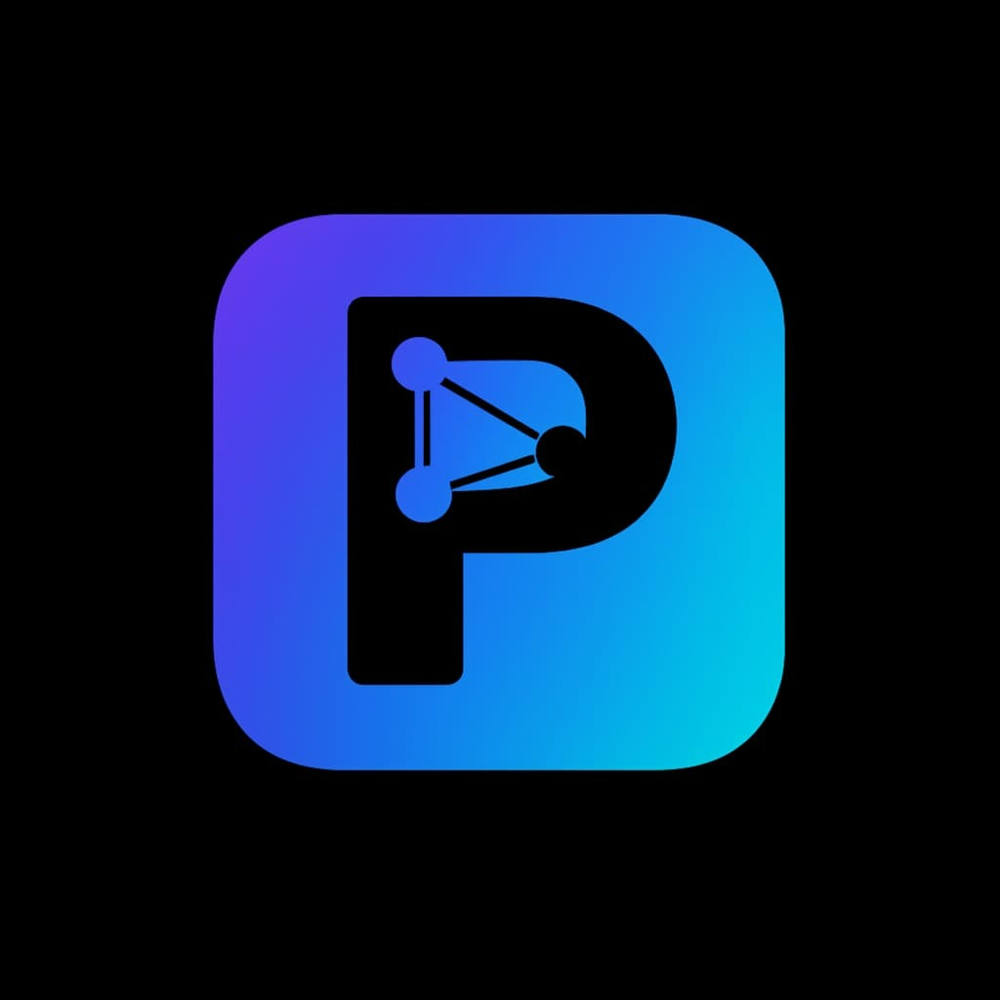

<div align="center">

  

  # PeerNet v2.2
  ### Production-Grade Social Platform

  <p align="center">
    <b>Real-time. Secure. Built for scale.</b>
  </p>

  <div>
    
    
    
    
  </div>

  <br />

  [Live App](https://peer-net-indol.vercel.app) &nbsp;•&nbsp; [API Docs](https://peernet-5u5q.onrender.com/api-docs) &nbsp;•&nbsp; [Health Check](https://peernet-5u5q.onrender.com/health)

</div>

---

## What is PeerNet?

PeerNet is a full-stack social media platform built from scratch. It supports real-time messaging, stories, posts, notifications, and a complete admin governance console — all under a dark-themed, high-fidelity UI built with React and Framer Motion.

---

## Features

| Feature | Description | Status |
| :--- | :--- | :---: |
| **Auth System** | JWT-based login, registration, and session management | Live |
| **Posts & Stories** | Create, like, comment, and share content. Stories expire automatically via Cron | Live |
| **Shorts (Dscrolls)** | TikTok-style vertical video scroll with smooth transitions | Live |
| **Real-time Chat** | Instant messaging via Socket.io with typing indicators and presence | Live |
| **Notifications** | Live notification engine with smart batching | Live |
| **Follow System** | Follow/unfollow with real-time follower count updates | Live |
| **Admin Console** | Full governance dashboard — manage users, posts, comments, reports, audit logs, and system health | Live |
| **Rate Limiting** | Sliding-window brute-force and DDoS mitigation | Live |
| **CDN Media** | Images and videos hosted on Cloudinary with optimized delivery | Live |

---

## Admin Console

The Admin Console is a dedicated governance interface built for platform operators:

- **Dashboard** — Key platform metrics at a glance (users, posts, comments, reports)
- **Users** — View, verify, and remove user accounts
- **Posts** — Browse and moderate all platform content
- **Comments** — Review and delete community comments
- **Reports** — Process user-submitted violation reports with one-click resolution
- **Audit Log** — Permanent, immutable record of every admin action
- **System Health** — Live infrastructure load, latency, and active user count
- **Settings** — Danger zone for full platform resets (double-authenticated)

---

## Architecture

```
Client (React + Vite)
    │
    ├── REST API  ──────► Express API Gateway ──► MongoDB Atlas
    │                           │
    └── WebSocket ──────► Socket.io Service  ──► Redis Pub/Sub
                                │
                            Cloudinary CDN (media)
```

- **Frontend**: React 18, Vite, Framer Motion, Tailwind CSS
- **Backend**: Node.js, Express, Mongoose, Joi validation
- **Realtime**: Socket.io with Redis adapter for horizontal scaling
- **Database**: MongoDB Atlas (primary), Redis Cloud (cache + pub/sub)
- **Media**: Cloudinary
- **Deploy**: Vercel (frontend) + Render (backend)

---

## Getting Started

```bash
# Clone the repo
git clone https://github.com/syedmukheeth/PeerNet.git
cd PeerNet

# Install all dependencies
npm install            # root
cd backend && npm install
cd ../frontend && npm install

# Copy environment files and fill in your values
cp backend/.env.example backend/.env
cp frontend/.env.example frontend/.env
```

**Run in development:**

```bash
# Terminal 1 — Backend API
cd backend && npm run dev

# Terminal 2 — Chat / Realtime Service
cd chat-service && npm run dev

# Terminal 3 — Frontend
cd frontend && npm run dev
```

**Run with Docker:**

```bash
docker compose up -d --build
```

---

## Environment Variables

| Variable | Description |
| :--- | :--- |
| `MONGO_URI` | MongoDB Atlas connection string |
| `JWT_SECRET` | Secret key for JWT signing |
| `REDIS_URL` | Redis connection URL |
| `CLOUDINARY_URL` | Cloudinary upload credentials |
| `CLIENT_URL` | Frontend origin for CORS |

---

## Security

- JWT with HTTP-only cookies and rotation
- Sliding-window rate limiting on all auth routes
- Helmet for hardened HTTP headers
- CORS with explicit origin allowlist
- Input validation on every endpoint via Joi
- Admin routes protected by role-based access control

---

## Compliance

- GDPR-ready cookie consent
- On-platform Privacy Policy and Terms of Service
- In-app bug reporting and feedback system

---

<div align="center">
  <p>Built by <b><a href="https://github.com/syedmukheeth">Syed Mukheeth</a></b></p>

  <a href="https://linkedin.com/in/syedmukheeth"></a>
  <a href="https://github.com/syedmukheeth"></a>
</div>
